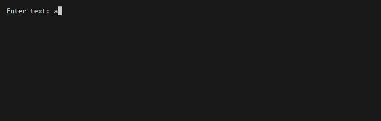
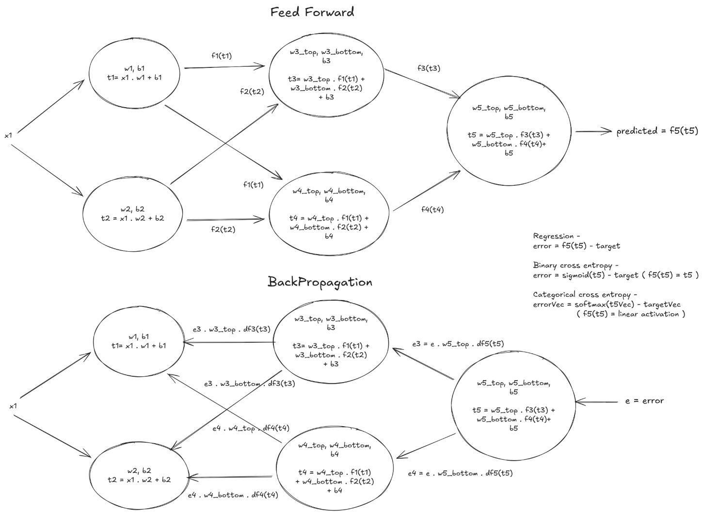

# Concurrent Neural Network SDK in Go

A from-scratch, fully concurrent neural network simulator in Go - each neuron runs a goroutine and communicates via channels, mimicking asynchronous biological signalling.

This project is an educational exploration of how Go's concurrency primitives can model the parallel, asynchronous behavior of biological neural networks.

---
Autoregressive text generation


---
Neural network Architecture


## 🚀 Features

* **Concurrent Architecture:** Each neuron runs a single goroutine and communicates through four dedicated channels - receiving inputs from the previous layer, sending outputs forward, receiving errors from the next layer, and sending errors backward.
* **Backpropagation:** Implements the standard backpropagation algorithm for training, fully utilizing the channel-based architecture.
* **Weight Persistence:** Includes functionality to save and load trained weights using a JSON file (weights.json).
* **Data Handling:** Provides a utility function (`LoadCSV`) for loading training data from a CSV, including automatic handling and **one-hot encoding** of categorical features.
* **Loss Functions:** Supports

  * **Mean Squared Error (MSE)** for regression tasks
  * **Binary Cross Entropy (BCE)** for binary classification
  * **Categorical Cross Entropy (CCE)** for multi-class classification

---

## ⚠️ Performance & Experimental Use Cases

It is important to note that mapping every neuron to a goroutine introduces significant **context switching and channel synchronization overhead**. As a result, this architecture is considerably slower for standard dense network training compared to traditional matrix-multiplication engines (like PyTorch or TensorFlow).

 However, this is a good playground for experimenting with architectures where asynchronous behavior is beneficial, specifically:
* **Spiking Neural Networks (SNNs):** Where timing and distinct firing events matter more than batch processing.
* **Sparse Neural Networks:** Where only a fraction of neurons are active, mitigating the overhead.
* **Dynamic Topology:** Evolving networks where neurons are added or removed at runtime without restructuring global matrices.

---

## 🧰 Getting Started

### Prerequisites

* Go (version 1.24 or later recommended)

### Installation

1. Clone the repository:

   ```bash
   git clone https://github.com/vishalvp-109989/go-rout-net.git
   cd go-rout-net
   go mod tidy
   ```

2. Acquire the sample data (e.g., a CSV named `data.csv`).

3. Run the training process:

   ```bash
   go run .
   ```

---

## ⚙️ Configuration

Key parameters and network structure can be adjusted directly in `main.go` using the `TrainingConfig` struct and layer definitions.

### **Training Configuration**

```go
cfg := TrainingConfig{
    Epochs:       100,       // Number of training epochs
    BatchSize:    1,         // Channel buffer size (micro-batching)
    LearningRate: 0.01,      // Step size for weight updates
    LossFunction: CATEGORICAL_CROSS_ENTROPY, // Choose one of: MSE, CATEGORICAL_CROSS_ENTROPY, BINARY_CROSS_ENTROPY
    KClasses:     2,         // Number of output classes (used only for categorical cross entropy)
    VerboseEvery: 10,        // Print training progress every N epochs
}
```

---

## 🧠 Network Initialization Examples

Below are examples of how to define the network and output layer for each supported loss function.

### **1️⃣ Mean Squared Error (Regression)**

Used for continuous value prediction tasks (e.g., predicting a number).

```go
nw := NewNetwork(
    Input(inputDim),
    Dense(16, Activation("relu")),
    Dense(8, Activation("relu")),
    Dense(4, Activation("relu")),
    Dense(1), // Single output neuron, linear is the default activation
)

cfg := TrainingConfig{
    Epochs:       100,
    BatchSize:    1,
    LearningRate: 0.01,
    LossFunction: MSE,
    VerboseEvery: 10,
}
```

---

### **2️⃣ Categorical Cross Entropy (Multi-Class Classification)**

Used when predicting **multiple classes** (e.g., softmax output).

```go
nw := NewNetwork(
    Input(inputDim),
    Dense(16, Activation("relu")),
    Dense(8, Activation("relu")),
    Dense(4, Activation("relu")),
    Dense(3), // Number of output classes
)

cfg := TrainingConfig{
    Epochs:       100,
    BatchSize:    1,
    LearningRate: 0.01,
    LossFunction: CATEGORICAL_CROSS_ENTROPY,
    KClasses:     3,  // Must match output layer neurons
    VerboseEvery: 10,
}
```

> ✅ The final layer output is passed through softmax internally during loss computation, and the error used for backpropagation is derived after applying the softmax transformation, ensuring correct gradient flow for multi-class classification

---

### **3️⃣ Binary Cross Entropy (Binary Classification)**

Used for **two-class** problems (e.g., predicting 0 or 1).

```go
nw := NewNetwork(
    Input(inputDim),
    Dense(16, Activation("relu")),
    Dense(8, Activation("relu")),
    Dense(4, Activation("relu")),
    Dense(1), // Single neuron for binary probability
)

cfg := TrainingConfig{
    Epochs:       100,
    BatchSize:    1,
    LearningRate: 0.01,
    LossFunction: BINARY_CROSS_ENTROPY,
    VerboseEvery: 10,
}
```

> ✅ The output neuron produces a probability (0–1 range). Internally uses **sigmoid activation** and **binary cross-entropy** loss.

---

## 🧩 Summary of Configuration Options

| Parameter      | Description                                          | Example                                                    |
| -------------- | ---------------------------------------------------- | ---------------------------------------------------------- |
| `LossFunction` | Selects which loss to optimize                       | `MSE`, `CATEGORICAL_CROSS_ENTROPY`, `BINARY_CROSS_ENTROPY` |
| `KClasses`     | Number of output classes (only for categorical loss) | `2`                                                        |
| `Epochs`       | Total number of training iterations                  | `100`                                                      |
| `BatchSize`    | Channel buffer size for micro-batching               | `1`                                                        |
| `LearningRate` | Step size for weight updates                         | `0.01`                                                     |
| `VerboseEvery` | Interval for logging progress                        | `10`                                                       |

---

## 🧾 Weight Saving & Persistence

The network automatically saves trained weights to `weights.json` **on exit (Ctrl+C)** and **on program completion**, and reloads them when available:

```go
if err := nw.LoadWeights("weights.json"); err != nil {
    log.Println("Error loading weights:", err)
}
```

---

## 📊 Example Output

```
Loaded dataset: 768 samples, 8 input features
Epoch 10: Loss=0.50231, Accuracy=76.04%
Epoch 20: Loss=0.41245, Accuracy=81.72%
Final Evaluation: Loss=0.331021, Accuracy=85.47%
Weights saved successfully.
```

---

## 🧩 Loss Function Constants

```go
const (
    MSE                       = iota // Mean Squared Error (Regression)
    CATEGORICAL_CROSS_ENTROPY        // Multi-Class Classification
    BINARY_CROSS_ENTROPY             // Binary Classification
)
```
